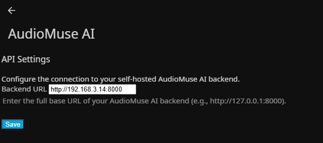
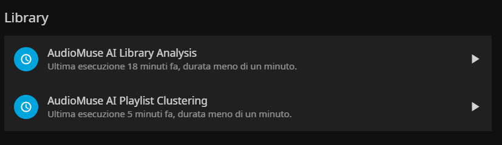

# AudioMuse AI-Plugin - The Jellyfin AudioMuse AI plugin

<p align="center">
  
</p>


**AudioMuse-AI-Plugin** is a Jellyfin plugin that integrates core AudioMuse-AI features into the Jellyfin front-end. It also provides a 1:1 API mapping, allowing front-end developers to interact directly with Jellyfin endpoints for seamless integration.

For the end-user the plugin directly integrate in Jellyfin this scheduled task:
* **Analysis task**: By default scheduled daily
* **Clustering task**: By default scheduled weekly
* **Sonic Fingerprint task**: By default scheduled weekly

Starting from **v0.0.8-alpha**, the plugin overrides Jellyfin's InstantMix feature to generate sonically similar mixes (based on prior AudioMuse-AI analysis) instead of random ones. **This behavior is automatically applied across all front-ends.**

**IMPORTANT NOTE:**
> * This is an alpha version of the plugin — use with caution.
> * After installation, the AudioMuse-AI-Plugin must be configured with the correct AudioMuse-AI endpoint. Make sure the AudioMuse-AI core container application is also deployed, as the plugin depends on it.


**The full list or AudioMuse-AI related repository are:** 
  > * [AudioMuse-AI](https://github.com/NeptuneHub/AudioMuse-AI): the core application, it run Flask and Worker containers to actually run all the feature;
  > * [AudioMuse-AI Helm Chart](https://github.com/NeptuneHub/AudioMuse-AI-helm): helm chart for easy installation on Kubernetes;
  > * [AudioMuse-AI Plugin for Jellyfin](https://github.com/NeptuneHub/audiomuse-ai-plugin): Jellyfin Plugin;
  > * [AudioMuse-AI MusicServer](https://github.com/NeptuneHub/AudioMuse-AI-MusicServer): **Experimental** Open Subosnic like Music Sever with integrated sonic functionality.

# Table of Contents
* [Versioning TAG](#versioning-tag)
* [Prerequisites](#prerequisites)
* [Installation and Configuration](#installation-and-configuration)
* [Usage](#usage)
* [Build Yourself](#build-yourself)
* [API Call Example](#api-call-example)
    * [Info](#info)
  * [Search Tracks](#search-tracks)
  * [Similar Tracks](#similar-tracks)
  * [Find Path](#find-path)
  * [Create Playlist](#create-playlist)
  * [Start Analysis](#start-analysis)
  * [Cancel Task](#cancel-task)
  * [Last Task](#last-task)
  * [Active Tasks](#active-tasks)
  * [Clustering](#clustering)
  * [Instant Chat Playlist](#instant-chat-playlist)
  * [Sonic Fingerprint Search](#sonic-fingerprint-search)
  * [Song Alchemy](#song-alchemy)
* [InstantMix](#instantmix)
* [Screenshots](#screenshots)
  * [Plugin Configurations Page](#plugin-configurations-page)
  * [Plugin Tasks Page](#plugin-tasks-page)
* [Contributing & Feedback](#contributing--feedback)


## Versioning TAG 
You will always have a specific tag version pluse the laster version. In future the devel tag could also be included.

Here some example:
* **v0.0.1-alpha** (developer preview)  
* **latest** (always points to the newest release)


## Prerequisites

- A running Jellyfin server  
- An existing [AudioMuse-AI](https://github.com/NeptuneHub/AudioMuse-AI) deployment (in its own container)


## Installation and Configuration
* Go on Jellyfin > Control Panel > Plugin Catalog
* Click on the gear-shaped settings icon on the top on the page to add a new manifest
* Add the AudioMuse AI manifest: https://raw.githubusercontent.com/NeptuneHub/audiomuse-ai-plugin/master/manifest.json
* Going back on Plugin Catalog youl will now show the plugin under the General section. Click on it and then install.
* **RESTART JELLYFIN**
* Now go back to the list of plugin installed, and you just need to configure the URL to reach AudioMuse-AI container, for example: http://192.168.3.14:8000

## Usage

**For Developer:** Once Jellyfin is back online, the AudioMuse-AI middleware will be loaded automatically. Your applications can now call Jellyfin’s API endpoints directly so no additional proxying through the AudioMuse-AI service is required.

**For the final user:** In the scheduled task section you will fine all the AudioMuse AI task. You can wait for their schedule or lunch directly (the first time is better to directly lunch them). The InstantMix functionality is reachable as usual by clicking on a specific Artist, Album, Song or Playlist with the right button and selecting the Instant Mix functionality.

## Build yourself

If you want download the repo, do some change and then re-build locally, here the step:

* Download the repo locally and do your change
```
git clone https://github.com/NeptuneHub/audiomuse-ai-plugin.git
```

* go in the root folder of the repo and run this command:
```
dotnet restore && dotnet publish -c Release -o ./publish
```

* The only file that you need is this one, you can ignore all the other:
```
Jellyfin.Plugin.AudioMuseAi.dll
```
In this **build-yourself** scenario you will need to copy&past the dll in an AudioMuse-AI directory under plugin manully.

IF instead you fork this repo, there is an automated workflow that automatically build when you add a new tag from git:
```
git tag v0.0.6-alpha        
git push origin v0.0.6-alpha
```

**Requirements:** For compiling the actual version of the repo you need dotnet-sdk-8.0, new version could require something newer, on Ubuntu/Debian install in this way:
```
sudo apt-get update
sudo apt-get install -y dotnet-sdk-8.0
```

## API CALL EXAMPLE
Below some API call example that you can run from linux cli, just remember to put in **YOUR-JELLYFIN-URL:PORT** and **YOUR-JELLYFIN-API-TOKEN**. For integration in a front-end you probably will not need the token because you will use the login session of the user.

For a more complete documentation rembemer to see the [AudioAMuse-AI](https://github.com/NeptuneHub/AudioMuse-AI) repo and also remember that the AudioMuse-AI API have an apiddocs that you can use like **http://YOUR-AUDIOMUSE-URL:PORT/apidocs/**. 

The aims is to replicate them 1:1, if this dosen't happen please feel a detailed issue (maybe with an example of call directly to AudioMuse-AI API and the different call to the AudioMuse-AI-Plugin API for check).

### info

Used for know the version of the plugin and the APi actually exposed.

**Important:** this API return the full list of API. If this are not documented here means that they are **experimental**.

```bash
curl -G 'http://YOUR-JELLYFIN-URL:PORT/AudioMuseAI/info' \
  -H 'Authorization: MediaBrowser Client="MyCLI", Device="Ubuntu CLI", DeviceId="ubuntu-cli-01", Version="1.0.0", Token="YOUR-JELLYFIN-API-TOKEN"' \
  -H 'Accept: application/json'
```

#### Output

```json
{
  "Version": "0.1.18.0",
  "AvailableEndpoints": [
    "GET /AudioMuseAI/active_tasks",
    "GET /AudioMuseAI/find_path",
    "GET /AudioMuseAI/health",
    "GET /AudioMuseAI/last_task",
    "GET /AudioMuseAI/playlists",
    "GET /AudioMuseAI/search_tracks",
    "GET /AudioMuseAI/similar_tracks",
    "GET /AudioMuseAI/sonic_fingerprint/generate",
    "GET /AudioMuseAI/status/{task_id}",
    "POST /AudioMuseAI/analysis",
    "POST /AudioMuseAI/cancel_all/{task_type_prefix}",
    "POST /AudioMuseAI/cancel/{task_id}",
    "POST /AudioMuseAI/chat/create_playlist",
    "POST /AudioMuseAI/chat/playlist",
    "POST /AudioMuseAI/clustering",
    "POST /AudioMuseAI/create_playlist"
  ]
}
```

---

### Search Tracks

Used for the **similar track feature** to search for tracks by artist and retrieve matching items.

```bash
curl -G 'http://YOUR-JELLYFIN-URL:PORT/AudioMuseAI/search_tracks' \
  --data-urlencode 'artist=red' \
  -H 'Authorization: MediaBrowser Client="MyCLI", Device="Ubuntu CLI", DeviceId="ubuntu-cli-01", Version="1.0.0", Token="YOUR-JELLYFIN-API-TOKEN"' \
  -H 'Accept: application/json'
```

#### Output

```json
[
  {"author":"author1","item_id":"7190693ae7d0b7740fbfc26e5bddd0b3","title":"song1"},
  {"author":"author2","item_id":"e614f2119e654493012ea80f7dd5c617","title":"song2"},
  {"author":"author3","item_id":"6110790c7650a09bbc72a9db84987c50","title":"song3"},
  {"author":"author4","item_id":"f3365202f0bec5011d84ab2d07a10d5b","title":"song4"},
  {"author":"author5","item_id":"9387b1a062ede11cd92229c4d6c9c5e5","title":"song5"},
  … 
]
```

---

### Similar Tracks

Used for the **similar track feature**; you supply an `item_id` and it returns a list of similar tracks.

```bash
curl -G 'http://YOUR-JELLYFIN-URL:PORT/AudioMuseAI/similar_tracks' \
  --data-urlencode 'item_id=07a998a337ab3fd4576006ae301d1d94' \
  --data-urlencode 'n=10' \
  --data-urlencode 'eliminate_duplicates=true' \
  -H 'Authorization: MediaBrowser Client="MyCLI", Device="Ubuntu CLI", DeviceId="ubuntu-cli-01", Version="1.0.0", Token="YOUR-JELLYFIN-API-TOKEN"' \
  -H 'Accept: application/json'

```

#### Output

```json
[
  {"author":"author1","distance":0.356,"item_id":"8d6bb1079eb9d6d16e4a5eb65435300d","title":"song1"},
  {"author":"author2","distance":0.396,"item_id":"fe6981aa033a80d4594a4148171beb2f","title":"song2"},
  {"author":"author3","distance":0.431,"item_id":"4fc055539c1cba3f143384609d10a3f6","title":"song3"},
  {"author":"author4","distance":0.431,"item_id":"54300affe6f9839596a37a3735690f92","title":"song4"},
  {"author":"author5","distance":0.477,"item_id":"31a92ee2d6f43da314cd8012b357cd8d","title":"song5"},
  … 
]
```

---

### Find Path

Used for the **pathfinding feature**; you supply a `start_song_id` and an `end_song_id`, and it returns a path of tracks connecting them that include initial and last song.
You can also specify `max_steps` to control the maximum number of hops.

```bash
curl -G 'http://YOUR-JELLYFIN-URL:PORT/AudioMuseAI/find_path' \
  --data-urlencode 'start_song_id=START-ID' \
  --data-urlencode 'end_song_id=END-ID' \
  --data-urlencode 'max_steps=25' \
  -H 'Authorization: MediaBrowser Client="MyCLI", Device="Ubuntu CLI", DeviceId="ubuntu-cli-01", Version="1.0.0", Token="YOUR-JELLYFIN-API-TOKEN"' \
  -H 'Accept: application/json'
```

#### Output

```json
{
  "path": [
    {"author":"author1","energy":0.072433084,"item_id":"07a998a337ab3fd4576006ae301d1d94","key":"D","mood_vector":"funk:0.226,rock:0.216,soul:0.125,jazz:0.121,80s:0.109","other_features":"danceable:0.56,aggressive:0.32,happy:0.28,party:0.66,relaxed:0.17,sad:0.17","scale":"minor","tempo":117.1875,"title":"song1"},
    {"author":"author2","energy":0.06923786,"item_id":"fe6981aa033a80d4594a4148171beb2f","key":"D","mood_vector":"rock:0.295,blues:0.248,funk:0.147,classic rock:0.136,jazz:0.093","other_features":"danceable:0.36,aggressive:0.25,happy:0.60,party:0.70,relaxed:0.15,sad:0.06","scale":"minor","tempo":110.29412,"title":"song2"},
    {"author":"author3","energy":0.11755472,"item_id":"66f8d07a3f016b0d1b4e04d7438b5a8b","key":"A","mood_vector":"rock:0.258,indie:0.093,alternative:0.089,blues:0.088,funk:0.084","other_features":"danceable:0.55,aggressive:0.47,happy:0.41,party:0.47,relaxed:0.17,sad:0.16","scale":"minor","tempo":104.166664,"title":"song3"},
    ...
  ],
  "total_distance":269.55337715148926
}

```
---


### Create Playlist

Used for the **similar track feature** to create a playlist from a list of track IDs.

```bash
curl -X POST 'http://YOUR-JELLYFIN-URL:PORT/AudioMuseAI/create_playlist' \
  -H 'Content-Type: application/json' \
  -H 'Authorization: MediaBrowser Client="MyCLI", Device="Ubuntu CLI", DeviceId="ubuntu-cli-01", Version="1.0.0", Token="YOUR-JELLYFIN-API-TOKEN"' \
  -d '{
        "playlist_name":"Similar to 21st Century2",
        "track_ids":[
          "07a998a337ab3fd4576006ae301d1d94",
          "8d6bb1079eb9d6d16e4a5eb65435300d",
          "fe6981aa033a80d4594a4148171beb2f",
          "4fc055539c1cba3f143384609d10a3f6",
          "54300affe6f9839596a37a3735690f92",
          "31a92ee2d6f43da314cd8012b357cd8d",
          "a335ef8354cf8e8d97fe0a91efdb55eb",
          "f9580efb7958d2454c76d8c463876cd3",
          "95f0ed149054afe123f5a7eb041add6f",
          "f2ecc48919b82e4bffe00dd2f5297501",
          "6d54b36b7a6421e361a593c283319ddf"
        ]
      }'
```

#### Output

```json
{"message":"Playlist 'Similar to 21st Century2' created successfully!","playlist_id":null}
```

---

### Start Analysis

Start the analysis **batch task** using default AudioMuse-AI settings.

```bash
curl -X POST 'http://YOUR-JELLYFIN-URL:PORT/AudioMuseAI/analysis' \
  -H 'Content-Type: application/json' \
  -H 'Authorization: MediaBrowser Client="MyCLI", Device="Ubuntu CLI", DeviceId="ubuntu-cli-01", Version="1.0.0", Token="YOUR-JELLYFIN-API-TOKEN"' \
  -d '{}'
```

#### Output

```json
{"status":"queued","task_id":"218f4340-f784-45ea-9f84-a034b2ca2898","task_type":"main_analysis"}
```

---

### Cancel Task

Used to cancel a **batch task** (analysis or clustering).

```bash
curl -X POST 'http://YOUR-JELLYFIN-URL:PORT/AudioMuseAI/cancel/e14b1eb8-2641-4b1c-8853-6b16d726ff40' \
  -H 'Authorization: MediaBrowser Client="MyCLI", Device="Ubuntu CLI", DeviceId="ubuntu-cli-01", Version="1.0.0", Token="YOUR-JELLYFIN-API-TOKEN"'
```

#### Output

```json
{"cancelled_jobs_count":5,"message":"Task e14b1eb8-2641-4b1c-8853-6b16d726ff40 and its children cancellation initiated. 5 total jobs affected.","task_id":"e14b1eb8-2641-4b1c-8853-6b16d726ff40"}
```

---

### Last Task

Used to retrieve the status of the last **batch task** run (analysis or clustering).

```bash
curl 'http://YOUR-JELLYFIN-URL:PORT/AudioMuseAI/last_task' \
  -H 'Authorization: MediaBrowser Client="MyCLI", Device="Ubuntu CLI", DeviceId="ubuntu-cli-01", Version="1.0.0", Token="YOUR-JELLYFIN-API-TOKEN"' \
  -H 'Accept: application/json'
```

#### Output

```json
{"details":{"message":"Task cancellation processed by API."},"progress":100,"running_time_seconds":38.143,"status":"REVOKED","task_id":"8a6b7eca-e85c-4065-8358-24f815f838a0","task_type":"album_analysis"}
```

---

### Active Tasks

Used to list any currently running **batch tasks** (analysis or clustering).

```bash
curl 'http://YOUR-JELLYFIN-URL:PORT/AudioMuseAI/active_tasks' \
  -H 'Authorization: MediaBrowser Client="MyCLI", Device="Ubuntu CLI", DeviceId="ubuntu-cli-01", Version="1.0.0", Token="YOUR-JELLYFIN-API-TOKEN"' \
  -H 'Accept: application/json'
```

#### Output

```json
{}
```

---

### Clustering

Start the clustering **batch task** using default AudioMuse-AI settings.

```bash
curl -X POST 'http://YOUR-JELLYFIN-URL:PORT/AudioMuseAI/clustering' \
  -H 'Content-Type: application/json' \
  -H 'Authorization: MediaBrowser Client="MyCLI", Device="Ubuntu CLI", DeviceId="ubuntu-cli-01", Version="1.0.0", Token="YOUR-JELLYFIN-API-TOKEN"' \
  -d '{
        "clustering_method":"kmeans",
        "max_distance":0.5,
        "max_songs_per_cluster":0,
        "pca_components_min":0,
        "pca_components_max":8,
        "clustering_runs":5000,
        "min_songs_per_genre_for_stratification":100,
        "stratified_sampling_target_percentile":50,
        "score_weight_diversity":2,
        "score_weight_purity":1,
        "score_weight_silhouette":0,
        "score_weight_davies_bouldin":0,
        "score_weight_calinski_harabasz":0,
        "score_weight_other_feature_diversity":0,
        "score_weight_other_feature_purity":0,
        "dbscan_eps_min":0.1,
        "dbscan_eps_max":0.5,
        "dbscan_min_samples_min":5,
        "dbscan_min_samples_max":20,
        "num_clusters_min":40,
        "num_clusters_max":100,
        "gmm_n_components_min":40,
        "gmm_n_components_max":100,
        "spectral_n_clusters_min":40,
        "spectral_n_clusters_max":100,
        "ai_model_provider":"NONE",
        "ollama_server_url":"http://192.168.3.15:11434/api/generate",
        "ollama_model_name":"mistral:7b",
        "gemini_api_key":"YOUR-GEMINI-API-KEY-HERE",
        "gemini_model_name":"gemini-1.5-flash-latest",
        "enable_clustering_embeddings":false
      }'
```

#### Output

```json
{"status":"queued","task_id":"1d609fa0-fc66-49e0-90b3-a5655b6c4292","task_type":"main_clustering"}
```

---

### Instant Chat Playlist

Used in the **Instant Playlist** feature to chat with the AI. You send a user query, and it returns both the AI’s reply and the list of tracks found.

```bash
curl -X POST 'http://YOUR-JELLYFIN-URL:PORT/AudioMuseAI/chat/playlist' \
  -H 'Content-Type: application/json' \
  -H 'Authorization: MediaBrowser Client="MyCLI", Device="Ubuntu CLI", DeviceId="ubuntu-cli-01", Version="1.0.0", Token="YOUR-JELLYFIN-API-TOKEN"' \
  -d '{
        "userInput":"Song with high energy",
        "ai_provider":"GEMINI",
        "ai_model":"gemini-1.5-flash-latest",
        "gemini_api_key":"YOUR-GEMINI-API-KEY"
      }'
```

#### Output

*Sample response not provided.*

---

### Sonic Fingerprint Search

Used in the **Audio Fingerprinting** feature to identify tracks in your Jellyfin library. You send a request, and it returns a list of matching tracks with metadata.

```bash
curl -X GET "http://YOUR-JELLYFIN-URL:PORT/AudioMuseAI/sonic_fingerprint/generate?jellyfin_user_identifier=YOUR-USER&jellyfin_token=YOUR-JELLYFIN-API-TOKEN" \
  -H "Accept: application/json"
```

#### Output

```json
[
  {"author":"Author1","distance":0.0,"item_id":"<ID1>","title":"Song1"},
  {"author":"Author2","distance":0.0,"item_id":"<ID2>","title":"Song2"},
  {"author":"Author3","distance":0.0,"item_id":"<ID3>","title":"Song3"},
  {"author":"Author4","distance":0.0,"item_id":"<ID4>","title":"Song4"},
  {"author":"Author5","distance":0.0,"item_id":"<ID5>","title":"Song5"},
  ...
  {"author":"AuthorN","distance":0.07,"item_id":"<IDN>","title":"SongN"}
]
```

### Song Alchemy

Song Alchemy ask a list of ADD or SUBTRACT song (minimum one ADD is required), a number of song that you want as output and the distance from the subtract. As a result it will give back a list of songs. 

**NOTE:** you can add a the temperature value, typically 1, if you want randomness in the result. Having it 0 or not passing it means no randomness.

You don't only have the `item_id` but also the `embedding_2d` that could be useful if you want to visually rappresent them on an XY graph.

```bash
curl POST 'http://YOUR-JELLYFIN-URL:PORT/AudioMuseAI/alchemy' \
  -H 'Content-Type: application/json' \
  -H 'Authorization: MediaBrowser Client="MyCLI", Device="Ubuntu CLI", DeviceId="ubuntu-cli-01", Version="1.0.0", Token="YOUR-JELLYFIN-API-TOKEN"' \
  -d '{
    "items": [
      {"id":"7190693ae7d0b7740fbfc26e5bddd0b3","op":"SUBTRACT"},
      {"id":"2caeeff701c08929f03261e95cdc022d","op":"ADD"},
      {"id":"574a710aa6fbe82963a9533484e243ff","op":"ADD"},
      {"id":"e614f2119e654493012ea80f7dd5c617","op":"ADD"}
    ],
    "n": 10,
    "subtract_distance": 0.2,
    "temperature": 1
  }'
```

#### Output

```json
{
  "add_centroid_2d": [0.0352683886, 0.1175260598],
  "add_points": [
    {
      "author": "Artist A",
      "embedding_2d": [0.1377602999, -0.3977809521],
      "item_id": "item_add_1",
      "title": "Track A"
    },
    {
      "author": "Artist B",
      "embedding_2d": [0.1512127596, 1.0],
      "item_id": "item_add_2",
      "title": "Track B"
    },
    {
      "author": "Artist C",
      "embedding_2d": [-0.1831678937, -0.2496408686],
      "item_id": "item_add_3",
      "title": "Track C"
    }
  ],
  "centroid_2d": [0.0352683886, 0.1175260598],
  "filtered_out": [],
  "projection": "discriminant",
  "results": [
    {
      "author": "Artist D",
      "distance": 0.1497469162,
      "embedding_2d": [0.1454330132, -0.2260514875],
      "energy": 0.15436153,
      "item_id": "item_result_1",
      "key": "D#",
      "mood_vector": "rock:0.559,indie:0.539,alternative:0.532,electronic:0.528,punk:0.527",
      "other_features": "danceable:0.63,aggressive:0.46,happy:0.45,party:0.29,relaxed:0.45,sad:0.45",
      "scale": "minor",
      "tempo": 156.25,
      "title": "Song 1"
    },
    ...
  ],
  "sub_points": [
    {
      "author": "Artist Z",
      "embedding_2d": [-0.7524615983, 0.0993635559],
      "item_id": "item_sub_1",
      "title": "Track Z"
    }
  ],
  "subtract_centroid_2d": [-0.7524615983, 0.0993635559]
}
```
### Max Distance
Get in input the id of the song and return as a result the max distanace possible from that song and the id of this max distantsong. In case of cosine similarity (enabled by default in AudioMuse-AI) the distance is between 0 and 2 where 0 is the same song and 2 id the totally opposite song.

```
curl 'http://YOUR-JELLYFIN-URL:PORT/AudioMuseAI/max_distance?item_id=07a998a337ab3fd4576006ae301d1d94' \
  -H 'Authorization: MediaBrowser Client="MyCLI", Device="Ubuntu CLI", DeviceId="ubuntu-cli-01", Version="1.0.0", Token="YOUR-JELLYFIN-API-TOKEN"' \
  -H 'Accept: application/json'
```
#### Output

```json
{"farthest_item_id":"c1ea3fb87ff0cd6e68b881715104fb28","max_distance":1.3198845386505127}
```

## InstantMix

The `InstantMix` feature in the AudioMuse-AI plugin generates dynamic song mixes based on the selected item (song, album, artist, playlist, or genre). It uses a multi-step fallback system to ensure results even when some services are unavailable.

### Mix Generation Logic

For each input type, the process follows this structure:

1. **Initial Song:** Sets the first track in the mix.
2. **Seed Selection:** Chooses seed tracks to generate similar songs.
3. **AudioMuse Similarity:** Fetches similar tracks using the AudioMuse AI engine.
4. **Fallbacks:** Fallback steps (in order) if AudioMuse fails or results are insufficient.

### Song

* **Initial Song:** The selected song.
* **Seed:** Only the original song.
* **AudioMuse:** Requests `limit - 1` similar songs in one call.
* **Fallbacks:**

  1. Jellyfin “Similar To” on the song.
  2. Random songs from the song’s genre(s).
  3. Random songs from the entire library.

###  Album

* **Initial Song:** Random song from the album.
* **Seed:** All album tracks, shuffled.
* **AudioMuse:** Requests `limit_per_seed * 4` similar tracks per song.
* **Fallbacks:**

  1. Jellyfin “Similar To” on the album.
  2. Random songs from combined genres of album tracks.
  3. Random songs from the entire library.

###  Playlist

* **Initial Song:** Random song from the playlist.
* **Seed:** Random shuffle of all tracks; up to 20 used as seeds.
* **AudioMuse:** Requests `limit_per_seed * 4` per seed.
* **Fallbacks:**

  1. Jellyfin “Similar To” on each seed song.
  2. Random songs from combined genres of playlist tracks.
  3. Random songs from the entire library.


###  Artist

* **Initial Song:** Random song by the artist.
* **Seed:** Random shuffle of all tracks; up to 20 used as seeds.
* **AudioMuse:** Requests `limit_per_seed * 4` per seed.
* **Fallbacks:**

  1. Jellyfin “Similar To” on the artist.
  2. Random songs from combined genres of artist's tracks.
  3. Random songs from the entire library.


### Genre

* **Initial Song:** None.
* **Seed:** None.
* **AudioMuse:** Skipped.
* **Fallbacks:**

  1. Random songs from the selected genre.
  2. Random songs from the entire library if genre is too small.

### Notes

* AudioMuse is always the first step (when applicable).
* If AudioMuse fails or returns too few results, fallback steps ensure the mix is filled.
* Genre mixes bypass AudioMuse and go straight to genre-based random selection.

## Screenshots

Here are a few glimpses of AudioMuse AI Plugin in action

### Plugin Configurations page



### Plugin Tasks page




## Contributing & Feedback

This is an alpha release for testing. Please open issues or pull requests on GitHub to report bugs, request features, or contribute improvements.

For mantainer: to start the github workflwo for compilation you just need to add a tag with git, so:
```
git tag v0.0.7-alpha        
git push origin v0.0.7-alpha
```
